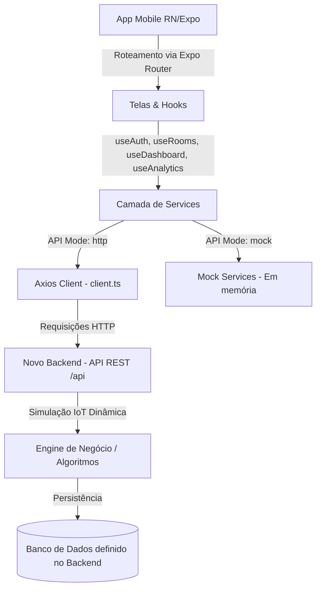
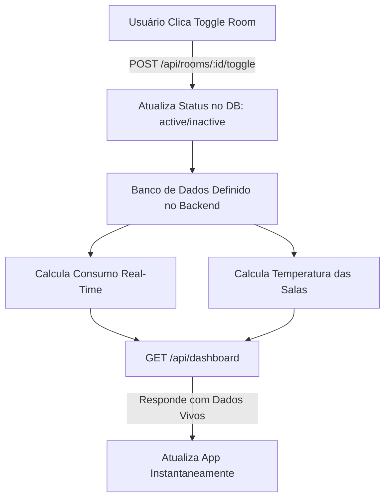

# Smart Campus IoT — Especificação Técnica e Contexto para o Desenvolvedor Backend

> **Documento de Contexto Autossuficiente (Self-Contained)**
> Este guia serve para subsidiar o subagente desenvolvedor backend com todo o contexto, arquitetura, contratos de tipos e dinâmicas necessárias para criar um backend completo em Python (FastAPI), desativando os mocks e tornando a aplicação **Smart Campus IoT** 100% funcional.

---

## 🗺️ 1. Visão Geral da Arquitetura do Sistema

A aplicação é um **Dashboard de Gerenciamento e Eficiência IoT** para um campus acadêmico inteligente. O ecossistema é composto por duas partes:

1. **Frontend Mobile (React Native + Expo SDK 54)**:

   - Utiliza **Expo Router** (roteamento baseado em arquivos).
   - Consome dados através de uma camada de **Services** que possui suporte duplo: `mock` (em memória com delay artificial) e `http` (integração real via Axios).
   - Atualmente, as telas de **Dashboard** e **Rooms** ainda utilizam dados mockados, enquanto **Auth** e **Analytics** possuem integrações HTTP parciais apontando para `http://localhost:3000/api`.
2. **Backend Server (A ser desenvolvido)**:

   - Deve expor uma API REST sob o prefixo `/api`.
   - Gerencia a persistência das salas e logs de consumo (banco de dados definido pelo Backend).
   - Implementa uma **Engine de Simulação IoT Dinâmica** onde as ações do usuário no app afetam os gráficos e métricas de forma realista.



---

## 🎨 2. Mapeamento das Telas e Fluxos do App ("De Cabo a Rabo")

O aplicativo mobile é composto por 4 fluxos de tela principais:

### A. Fluxo de Autenticação (`/login.tsx`)

* **Interface**: Campo de `E-mail` (validação com RegEx) e `Senha` (mínimo de 6 caracteres).
* **Lógica**: Utiliza o hook `useAuth` que invoca `services.auth.login`.
* **Comportamento Esperado**: Retorna um JWT válido e dados de perfil do usuário (`id`, `name`, `email`, `role`). Salva o estado no context `AuthContext` e redireciona para a aba principal `/(tabs)`.

### B. Tela de Dashboard Executivo (`/(tabs)/index.tsx`)

* **Objetivo**: Fornecer métricas rápidas consolidadas do campus e economia.
* **Componentes e Métricas**:
  - **Status Global da Escola**: Exibe uma badge de status com um ponto pulsante (`PulseDot`) indicando `"Tudo OK"` ou `"Atenção"` se houver falhas.
  - **Consumo Atual (⚡)**: Card principal com barra de progresso horizontal em roxo. Exibe o consumo instantâneo (`currentConsumption`) contra o limite máximo del campus (`consumptionMax`).
  - **Temperatura Média (🌡️)**: Temperatura calculada de todas as salas climatizadas ativas.
  - **Card de Economia Hero (💰)**: Exibe a economia financeira mensal convertida em reais (`monthlySavings`) e a porcentagem de ganho (`savingsPercent`). Contém um gráfico de barras (`BarChart`) que mostra a economia diária da semana.
  - **Monitoramento em Tempo Real**: Gráfico de linhas (`LineChart`) com um seletor para alternar entre as abas `"DIÁRIO"` e `"SEMANAL"`.

### C. Tela de Gerenciamento de Salas (`/(tabs)/rooms.tsx`)

* **Objetivo**: Controlar o ligar/desligar de aparelhos de climatização/iluminação de zonas específicas do campus.
* **Componentes**:
  - **Lista de Salas (`RoomCard`)**: Cada card exibe o nome da sala, bloco, andar, temperatura atual, uso individual de energia, uma badge de status (`active` / `inactive`) e um componente de **Toggle Switch** customizado.
  - **Toggle Lógica**: O usuário clica no switch para ligar/desligar a sala. Isso aciona o serviço `services.rooms.toggleRoom(id, status)` no backend.
  - **Consumo de Energia consolidado**: Um gráfico de barras vertical (`BarChart`) exibindo a eficiência energética semanal das salas.
  - **Botão de Relatório**: Ação decorativa para emitir relatórios de eficiência.

### D. Tela de Analytics e Insights (`/(tabs)/analytics.tsx`)

* **Objetivo**: Visualização analítica avançada do consumo e projeções futuras geradas por "IA".
* **Componentes**:
  - **Gráfico de Linha Dupla (`LineChart`)**: Exibe o consumo de energia **Real** (linha sólida ciano) vs. consumo **Previsto** (linha pontilhada verde/sucesso) com base no histórico histórico.
  - **Insight Inteligente (Gradiente Ciano ➔ Roxo)**: Card dinâmico que exibe quantos dias faltam para a escola bater a meta de eficiência (`predictedGoalDays`) baseado nos padrões ativos.
  - **Bento Grid de Estatísticas**:
    - Eficiência Geral (`efficiencyPercent` %)
    - Redução acumulada de CO2 (`co2Reduction` toneladas)
    - Custo Projetado financeiro (`projectedCost` vs. `projectedCostBaseline`) indicando a economia prevista em termos monetários.

---

## 📊 3. Modelo de Dados e Contratos TypeScript

O backend deve retornar estruturas que obedeçam aos tipos definidos no arquivo `src/services/types.ts`. Caso seja necessario alterar o contrato na API, deve-se lembrar de modificar também no mobile Qualquer variação de chaves ou tipagem quebrará a compilação do React Native (TypeScript strict habilitado).

```typescript
export type RoomStatus = 'active' | 'inactive';

// Estrutura de uma Sala do Campus
export interface Room {
  id: string;
  name: string;
  block: string;
  floor: string;
  status: RoomStatus;
  temperature: number;
  energyUsage: number;
}

// Sensores Externos (Meteorológicos e Ambientais)
export interface ExternalSensors {
  temperature: number;
  humidity: number;
  co2: number;
  windSpeed: number;
  status: RoomStatus;
}

// Ponto de Gráfico Semanal / Diário
export interface WeeklyDataPoint {
  day: string;            // Ex: "SEG", "TER", "QUA", "HOJE", "SEX", "SAB", "DOM"
  value: number;          // Valor numérico para o gráfico
  isCurrent?: boolean;    // Destaque para o dia atual no gráfico
  isFuture?: boolean;     // Renderiza o ponto tracejado/futuro
}

// Dados Consolidados do Dashboard
export interface DashboardData {
  currentConsumption: number;
  consumptionUnit: string;      // Fixado em "kWh"
  consumptionMax: number;
  avgTemperature: number;
  monthlySavings: number;
  savingsPercent: number;
  systemStatus: 'optimal' | 'warning' | 'critical';
  zoneCount: number;
  savingsChart: WeeklyDataPoint[];
  realtimeChart: WeeklyDataPoint[];
}

// Relatório do Analytics
export interface AnalyticsData {
  totalConsumption: number;
  consumptionUnit: string;      // Fixado em "kWh"
  efficiencyPercent: number;
  co2Reduction: number;
  projectedCost: number;
  projectedCostBaseline: number;
  predictedGoalDays: number;
  chart: WeeklyDataPoint[];
  forecastChart: WeeklyDataPoint[];
}

// Usuário do Sistema
export interface User {
  id: string;
  name: string;
  email: string;
  role: 'admin' | 'user';
}

// Credenciais de Login
export interface LoginCredentials {
  email: string;
  password?: string;
}

// Resposta da API de Login
export interface AuthResponse {
  user: User;
  token: string;
}
```

---

## ⚡ 4. Contratos de API (Especificação dos Endpoints REST)

O backend deve expor as seguintes rotas HTTP sob o prefixo `/api` (exemplo: `http://localhost:3000/api`):

### 🔑 Rota 1: Autenticação

* **Endpoint**: `POST /auth/login`
* **Headers**: `Content-Type: application/json`
* **Corpo da Requisição**:
  ```json
  {
    "email": "usuario@estacio.br",
    "password": "senha_secreta_minimo_6_caracteres"
  }
  ```
* **Resposta Esperada (200 OK)**:
  ```json
  {
    "user": {
      "id": "1",
      "name": "Prof. Mariano",
      "email": "usuario@estacio.br",
      "role": "admin"
    },
    "token": "seu-jwt-token-aqui"
  }
  ```

---

### 🏢 Rota 2: Obter Todas as Salas

* **Endpoint**: `GET /rooms`
* **Headers**: `Authorization: Bearer <token>`
* **Resposta Esperada (200 OK)**:
  ```json
  [
    {
      "id": "1",
      "name": "Sala de Aula 01",
      "block": "A",
      "floor": "Piso 1",
      "status": "active",
      "temperature": 22.5,
      "energyUsage": 0.8
    },
    {
      "id": "2",
      "name": "Laboratório",
      "block": "B",
      "floor": "Piso 2",
      "status": "inactive",
      "temperature": 25.0,
      "energyUsage": 0.0
    },
    {
      "id": "3",
      "name": "Auditório",
      "block": "C",
      "floor": "Térreo",
      "status": "active",
      "temperature": 21.0,
      "energyUsage": 1.2
    }
  ]
  ```

---

### 🔄 Rota 3: Alternar Status de uma Sala (Toggle Switch)

* **Endpoint**: `POST /rooms/:id/toggle`
  - *Nota*: O frontend no hook `useRooms.ts` espera chamar `services.rooms.toggleRoom(id, next)` onde `next` é `'active' | 'inactive'`.
* **Headers**: `Authorization: Bearer <token>`, `Content-Type: application/json`
* **Corpo da Requisição**:
  ```json
  {
    "status": "active"
  }
  ```
* **Resposta Esperada (200 OK)**: A sala com o status e parâmetros dinâmicos atualizados.
  ```json
  {
    "id": "1",
    "name": "Sala de Aula 01",
    "block": "A",
    "floor": "Piso 1",
    "status": "active",
    "temperature": 22.5,
    "energyUsage": 0.8
  }
  ```

---

### ☁️ Rota 4: Sensores Externos (Estação Meteorológica do Campus)

* **Endpoint**: `GET /rooms/sensors/external`
* **Headers**: `Authorization: Bearer <token>`
* **Resposta Esperada (200 OK)**:
  ```json
  {
    "temperature": 26.8,
    "humidity": 62,
    "co2": 405,
    "windSpeed": 14.2,
    "status": "active"
  }
  ```

---

### 📈 Rota 5: Obter Dados do Dashboard Consolidado

* **Endpoint**: `GET /dashboard`
* **Headers**: `Authorization: Bearer <token>`
* **Resposta Esperada (200 OK)**:
  ```json
  {
    "currentConsumption": 42.8,
    "consumptionUnit": "kWh",
    "consumptionMax": 65.0,
    "avgTemperature": 22.1,
    "monthlySavings": 1250.0,
    "savingsPercent": 14.2,
    "systemStatus": "optimal",
    "zoneCount": 12,
    "savingsChart": [
      { "day": "SEG", "value": 38 },
      { "day": "TER", "value": 62 },
      { "day": "QUA", "value": 48 },
      { "day": "HOJE", "value": 86, "isCurrent": true },
      { "day": "SEX", "value": 43 },
      { "day": "SAB", "value": 53, "isFuture": true },
      { "day": "DOM", "value": 67, "isFuture": true }
    ],
    "realtimeChart": [
      { "day": "SEG", "value": 30 },
      { "day": "TER", "value": 55 },
      { "day": "QUA", "value": 42 },
      { "day": "QUI", "value": 68 },
      { "day": "SEX", "value": 51 },
      { "day": "SAB", "value": 45 },
      { "day": "DOM", "value": 60 }
    ]
  }
  ```

---

### 📊 Rota 6: Obter Dados de Analytics e IA

* **Endpoint**: `GET /analytics`
* **Headers**: `Authorization: Bearer <token>`
* **Resposta Esperada (200 OK)**:
  ```json
  {
    "totalConsumption": 1240,
    "consumptionUnit": "kWh",
    "efficiencyPercent": 14,
    "co2Reduction": 0.8,
    "projectedCost": 4250,
    "projectedCostBaseline": 5100,
    "predictedGoalDays": 12,
    "chart": [
      { "day": "SEG", "value": 45 },
      { "day": "TER", "value": 60 },
      { "day": "QUA", "value": 50, "isCurrent": true },
      { "day": "QUI", "value": 55 },
      { "day": "SEX", "value": 70 },
      { "day": "SAB", "value": 40, "isFuture": true },
      { "day": "DOM", "value": 35, "isFuture": true }
    ],
    "forecastChart": [
      { "day": "SEG", "value": 48 },
      { "day": "TER", "value": 55 },
      { "day": "QUA", "value": 52, "isCurrent": true },
      { "day": "QUI", "value": 58 },
      { "day": "SEX", "value": 65 },
      { "day": "SAB", "value": 45, "isFuture": true },
      { "day": "DOM", "value": 40, "isFuture": true }
    ]
  }
  ```

---

## ⚙️ 5. Lógica da Engine de Simulação IoT Dinâmica (Nuance Crítica)

### A Lógica do Loop de Simulação

A engine de simulação no backend deve calcular as métricas consolidadas com base no status atualizado das salas cadastradas na tabela definida no backend:

1. **Cálculo do `currentConsumption` (Consumo Atual)**:

   - Toda vez que uma sala está `active`, seu `energyUsage` individual deve ser computado.
   - Fórmula:
     $$
     \text{Consumo Atual} = \text{Consumo Base Estático} + \sum (\text{energyUsage das salas com status 'active'})
     $$

     *Exemplo*: Consumo Base = 25.0 kWh. Se a Sala 01 (0.8 kWh) e o Auditório (1.2 kWh) estiverem ativos, o consumo consolidado no `/dashboard` deve retornar `27.0 kWh`. Se o usuário desativar o Auditório via aplicativo, o consumo instantâneo no `/dashboard` deve cair para `25.8 kWh`.
2. **Cálculo do `avgTemperature` (Temperatura Média)**:

   - Salas ativas têm o ar-condicionado/climatizador ligado e a temperatura cai. Salas inativas esquentam gradualmente.
   - Fórmula na consulta `/dashboard`:
     - Se `status == 'active'`, temperatura converge para `21.0°C` (temperatura de refrigeração padrão).
     - Se `status == 'inactive'`, temperatura sobe para `25.5°C` (temperatura ambiente sem refrigeração).
     - $\text{avgTemperature}$ é a média aritmética das temperaturas de todas as salas no banco de dados.
3. **Determinação do `systemStatus` (Status Global)**:

   - **optimal**: Consumo atual abaixo de 75% de `consumptionMax`.
   - **warning**: Consumo atual entre 75% e 95% de `consumptionMax`.
   - **critical**: Consumo atual acima de 95% de `consumptionMax` ou temperatura média do campus acima de `26°C`.



---

## 🔌 6. Integração no App Mobile (De Mock para HTTP)

Para garantir que o app mobile passe a consuming o novo backend em produção/desenvolvimento, o desenvolvedor backend precisará orientar ou realizar as seguintes modificações no código do App React Native:

### Passo A: Criar o Arquivo `src/services/http/rooms.ts`

Implementar a comunicação real com a API utilizando o cliente Axios:

```typescript
import { IRoomService } from '../interfaces';
import { Room, ExternalSensors } from '../types';
import { api } from './client';

export const roomsHttpService: IRoomService = {
  async getRooms(): Promise<Room[]> {
    const { data } = await api.get<Room[]>('/rooms');
    return data;
  },

  async toggleRoom(id: string, status: 'active' | 'inactive'): Promise<Room> {
    const { data } = await api.post<Room>(`/rooms/${id}/toggle`, { status });
    return data;
  },

  async getExternalSensors(): Promise<ExternalSensors> {
    const { data } = await api.get<ExternalSensors>('/rooms/sensors/external');
    return data;
  },
};
```

### Passo B: Criar o Arquivo `src/services/http/dashboard.ts`

Fazer o mesmo para o dashboard:

```typescript
import { IDashboardService } from '../interfaces';
import { DashboardData } from '../types';
import { api } from './client';

export const dashboardHttpService: IDashboardService = {
  async getDashboard(): Promise<DashboardData> {
    const { data } = await api.get<DashboardData>('/dashboard');
    return data;
  },
};
```

### Passo C: Configurar o Seletor de Camada em `src/services/index.ts`

Substituir os mocks remanescentes pelas implementações HTTP reais quando o modo HTTP estiver ativo:

```typescript
import { IServices } from './interfaces';
import { mockServices } from './mock';
import { analyticsHttpService } from './http/analytics';
import { authHttpService } from './http/auth';
import { roomsHttpService } from './http/rooms';
import { dashboardHttpService } from './http/dashboard';

function getHttpServices(): IServices {
  return {
    auth: authHttpService,
    analytics: analyticsHttpService,
    rooms: roomsHttpService,       // Trocado do mock para HTTP Real
    dashboard: dashboardHttpService, // Trocado do mock para HTTP Real
  };
}

export function getServices(): IServices {
  const mode = process.env.EXPO_PUBLIC_API_MODE ?? 'mock';
  if (mode === 'http') return getHttpServices();
  return mockServices;
}

export const services = getServices();
```

---

## 🚀 Prontidão para o Subagente Backend

Este documento contém o escopo técnico completo e fechado. O subagente backend possui aqui todas as premissas, modelos e endpoints necessários para construir o servidor sem precisar de interações adicionais sobre os requisitos de dados do aplicativo móvel.
